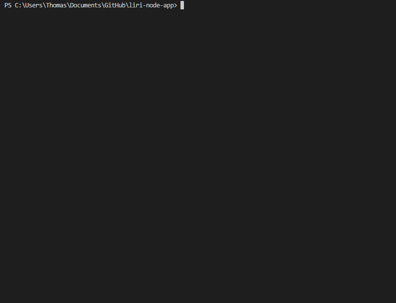

# Liri Node APP

It's like SIRI, but not.

This project uses Node to get information from Twitter, Spotify and OMDB.

Uses the Twitter, Spotify, Request, and DotEnv modules.

Accetpable commands:

node liri.js + :

my-tweets (gets your last 20 tweets and the date created)

spotify-this-song "song name" (gets the top 5 of search by track from Spotify)

movie-this "movie name" (gets the movie from OMDB with movie information.)

do-what-it-says (this takes the first and second position in the random.txt file and uses the above functions.)